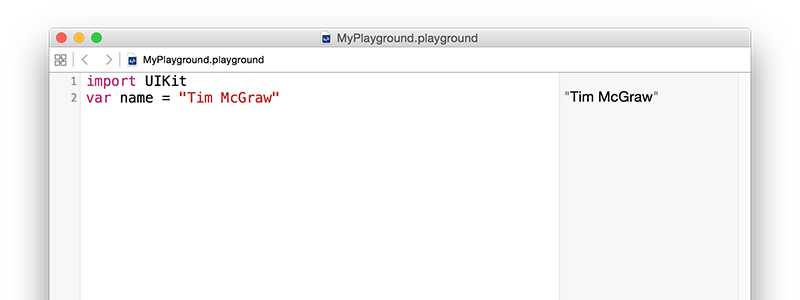

# Variabelen en constanten

Ieder bruikbaar programma moet op een gegeven moment gegevens opslaan, en in swift zijn daar twee manieren voor: variabelen en constanten. Een variabele kan gegevens opslaan die je elke keer weer kunt veranderen, en een constante is een opslag waar je één keer iets in kunt stoppen en dat nooit meer gewijzigd kan worden. Variabelen hebben dus variabele waarden, en constanten hebben waarden die constant blijven – makkelijk toch?
 
Het hebben van allebei de opties lijkt zinloos, immers je kunt ook gewoon een variabele maken die je nooit verandert – waarom moet je daar een constante van maken? Welnu, het blijkt dat veel programmeurs geen perfecte programmeurs zijn –schokkend!– en dat we fouten maken.

Een van de voordelen om constanten en variabelen te scheiden, is dat Xcode ons vertelt als we een fout maken. Als we zeggen: "maak deze datum een constante, want ik weet dat het nooit zal veranderen", en dan probeer je het 10 regels later te veranderen, dan zal Xcode weigeren je applicatie te bouwen.

Constanten zijn ook belangrijk omdat ze Xcode sturen in hoe het je applicatie moet bouwen. Als het weet dat een waarde nooit zal wijzigen, kan het je code optimaliseren om het sneller te laten werken.

In Swift maak je een variabele met het `var` trefwoord, zoals hier:

    var naam = "Tim McGraw"

Laten we dat in een playground stoppen zo dat je kan zien wat het doet. Verwijder alle tekst behalve de  `import UIKit` regel –dat is het gedeelte dat Apple's basis iOS code laadt en het is later nodig–, en voeg deze variable definitie toe. Je zou iets als de volgende afbeelding moeten zien.

Omdat het een variabele is, kun je het elk moment veranderen, maar het `var` trefwoord heb je niet elke keer nodig – dat is alleen maar nodig als je nieuwe variabelen declareert. Probeer dit maar te schrijven:

    var naam = "Tim McGraw"
    naam = "Romeo"

De eerste regel creëert de `name` variabele en geeft het een beginwaarde, op de tweede regel verander je de `name` variabele zodat de waarde nu "Romeo" is.
In het resultaten gedeelte aan de rechterkant zie je beide waarden afgedrukt worden.

Wat zou er gebeuren als je een constante had gemaakt in plaats van een variabele? Constanten maak je met het `let` trefwoord in plaats van `var`, dus je kunt de eerste regel veranderen zodat er `let naam` staat in plaats van `var naam`, zoals hier:

    import UIKit
    let naam = "Tim McGraw"
    naam = "Romeo"

Maar nu is er een probleem: Xcode laat een rood waarschuwings symbool zien naast regel drie, en het moet een kringeltje onder `naam` hebben getekend.
Als je op het rode waarschuwings symbool klikt, zal Xcode je vertellen wat het probleem is: "Cannot assign to 'let' value 'name'" – dat Xcode-spraak is voor "je probeert de waarde van een constante te veranderen en dat kan niet."

Constanten zijn dus een prima manier om Swift en jezelf te beloven dat een waarde niet zal veranderen, want als je dat wel doet zal Xcode weigeren om je app te runnen.
Swift developers hebben een grote voorkeur om constanten overal waar mogelijk te gebruiken omdat het je code begrijpelijker maakt. Sterker nog, in de allerlaatste versie van Swift zal Xcode je vertellen als je een variabele maakt die je vervolgens nergens verandert!

**Belangrijke mededeling:** variabele en constante namen moeten uniek zijn in je code. Je krijgt een foutmelding als je dezelfde variabele naam twee keer aanmaakt, zoals hier:

    var naam = "Tim McGraw"
    var naam = "Romeo"

Als de playground een fout in je code vindt, zal het óf een rode waarschuwings laten zien, of het weigert simpelweg te runnen. Het laatste wordt je duidelijk gemaakt omdat de tekst in het resultaat scherm grijs wordt in plaats van het gebruikelijke zwart.
