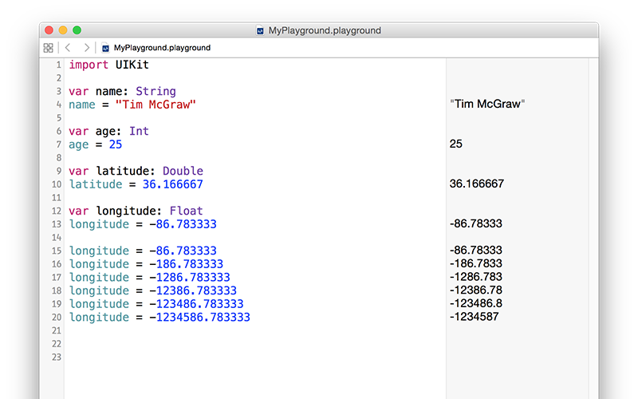

# 数据类型

数据类型有很多种，Swift 分别处理它们。在给变量赋值文本时，您已经看到了最重要的类型之一，在Swift中称为 `String` —— 字面意思是一个串字符。

字符串可以是长的（例如，一百万个字母或更多）、短的（例如，10个字母）甚至空的（没有字母），这无关紧要：在Swift眼中，它们都是字符串，并且都以同行的方式处理。Swift 知道 `name` 应该保存一个字符串，因为当你创建它时，你给它分配一个字符串：“Tim McGraw”。如果您把代码改写成下面这样，它将停止运行：

    var name
    name = "Tim McGraw"

这时 Xcode 将给出一条错误消息，该消息目前还没有多大意义：“Type annotation missing in pattern”。它的意思是，“我搞不清 `name` 是什么数据类型，因为你没有给我足够的信息。”

此时，您有两种选择：要么创建变量并在一行代码上给它一个初始值，要么使用称为类型注释，即告诉 Swift 变量稍后将保持什么数据类型，即使您现在没有给它赋值。

您已经看过了第一种方法，因此让我们看看第二种方法：类型注释。我们知道 `name` 将是一个字符串，所以我们可以通过写冒号然后 `String` 告诉 Swift，像这样：

    var name: String
    name = "Tim McGraw"

在实际的应用程序项目中（与playgrounds相反），我们也可以这么写。因为Swift知道将来 `name` 会保存什么类型的数据。Playgrounds 是一个稍微特殊的情况，所以您仍然会在 playground 得到一个错误。

**注意:** 有些人喜欢在冒号前后留个空格，`var name : String`，这么做是不对的，但你应该尽量避免在礼貌的场合提出他们的错误。

这里所学到的是，Swift 总是想知道每个变量或常量将保存什么类型的数据。你不能避免它，这是件好事，因为它提供了所谓的类型安全-如果你说“这将是一个字符串”，然后稍后尝试把兔子放在那里，Swift 会拒绝。

现在我们可以引入另一种重要的数据类型，叫做**Int**，它是 “integer” 的缩写。整数是取整的数，比如3、30、300或-16777216。例如：

    var name: String
    name = "Tim McGraw"

    var age: Int
    age = 25

它声明一个变量为字符串，一个变量为整数。请注意 `String` 和 `Int` 在开头都具有大写字母，而 `name` 和 `age` 则不具有大写字母 —— 这是 Swift 中的标准编码约定。编码约定对 Swift 来说无关紧要（您可以按照自己的喜好写自己的名字！）但对其他开发人员来说确实很重要。在这种情况下，数据类型以大写字母开始，而变量和常量则不用。

现在我们有两个不同类型的变量，你可以看到类型安全的行动。试着写这个：

    name = 25
    age = "Tim McGraw"

在该代码中，您试图将整数赋值给字符串变量，将字符串赋值给整数变量——幸运的是，Xcode 将抛出错误。您可能认为这是迂腐的，但实际上非常有用：您承诺变量将保存一种特定类型的数据，并且 Xcode 将在您的整个工作中执行这种承诺。

**在继续之前，请删除导致错误的那两行代码，否则您的 playground 上没有任何东西可以继续工作！**

## Float 和 Double

让我们看看另外两种数据类型，称为`Float` 和 `Double`。这是Swift用小数部分存储数字的方法，例如3.1、3.141、3.1415926 和 -16777216.5。这里有两种数据类型，因为你可以选择你想要的精确度，但是大多数时候这无关紧要，所以苹果官方的建议总是使用 `Double`，因为它具有最高的准确度。

试着把这个放到你的playground上：

    var latitude: Double
    latitude = 36.166667

    var longitude: Float
    longitude = -86.783333

你可以看到两个数字都出现在右边，但是要仔细看，因为两者有微小的差别。我们说过`longitude` 应该等于-86.783333，但是在结果窗格中，您会看到 -86.78333 ——它最后缺少一个3。现在，你可能会说，“0.000003在朋友之间有什么关系？”但这很好地证明了我所说的准确性。

因为 playgrounds 会随着你输入的内容而更新，所以我们可以尝试一下，这样你就可以清楚地看到 `Float` 和 `Double` 的区别。尝试将代码更改为：

    var longitude: Float
    longitude = -86.783333
    longitude = -186.783333
    longitude = -1286.783333
    longitude = -12386.783333
    longitude = -123486.783333
    longitude = -1234586.783333

也就是在小数点之前增加数字，而在小数点之后保持相同数量的数字。但如果您在结果窗格中查看，您将注意到在点之前添加更多数字时，Swift 将在点之后删除数字。这是因为它的存储空间有限，所以它首先存储最重要的部分——删除1000000是一件大事，而删除0.000003则不那么重要。

现在，试着将 `Float` 改为 `Double`，您将看到Swift每次都打印出正确的数字：

    var longitude: Double

这是因为，`Double` 的准确度是 `Float` 的两倍，所以它不需要为了适应而减少你的数字。尽管如此，Double 仍然有局限性 —— 如果你尝试像 123456789.123456789这样的大量数字，你会发现它被削减到123456789.12345679。

## Boolean

Swift 有一个内置的数据类型，可以存储值是真还是假，称为 `Bool`，是 Boolean 的简称。Bool 没有“可能”这个值，只有绝对值：真或假。例如：

    var stayOutTooLate: Bool
    stayOutTooLate = true

    var nothingInBrain: Bool
    nothingInBrain = true

    var missABeat: Bool
    missABeat = false

## 明智地使用类型注释

正如您所学习的，有两种方法可以告诉 Swift 变量包含什么类型的数据：在创建变量时分配值，或者使用类型注释。如果可以选择，第一种总是比较好，因为它比较清楚。例如：

    var name = "Tim McGraw"

优先于:

    var name: String
    name = "Tim McGraw"

这适用于所有数据类型。例如：

    var age = 25
    var longitude = -86.783333
    var nothingInBrain = true

这种技术称为*类型推断*，因为 Swift 可以通过查看要放入的数据类型来推断变量应该使用什么数据类型。当涉及到 -86.78333333 这样的数字时，Swift 总是推断出`Double` 而不是 `Float`。

为了完整起见，我应该补充一点，可以指定数据类型并同时提供值，如下所示：

    var name: String = "Tim McGraw"
